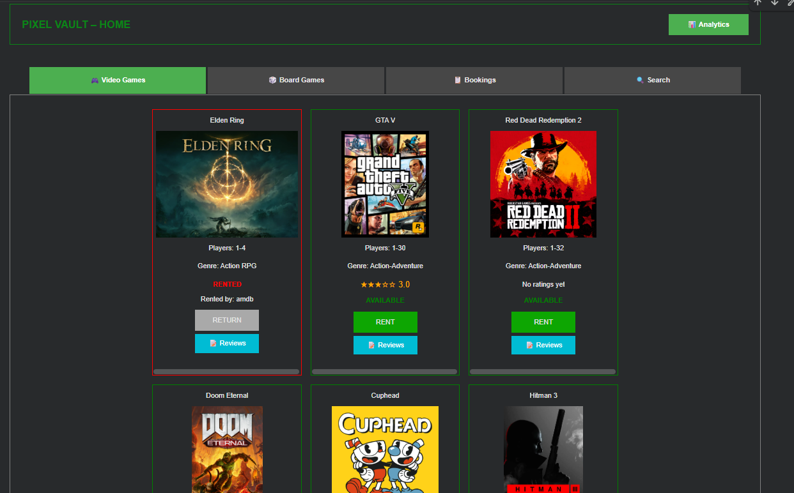
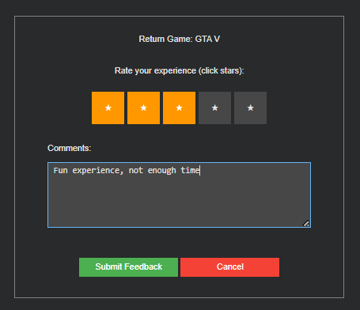
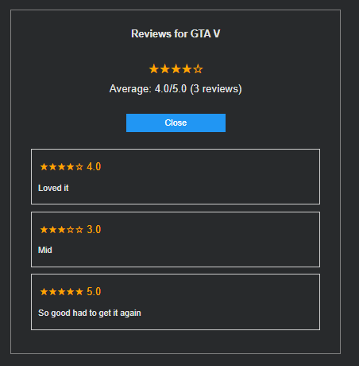
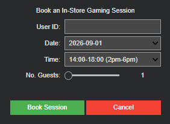
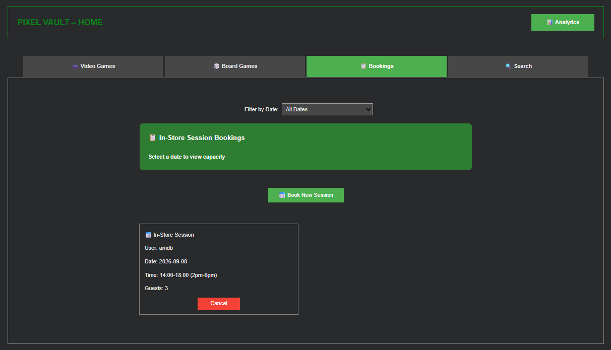
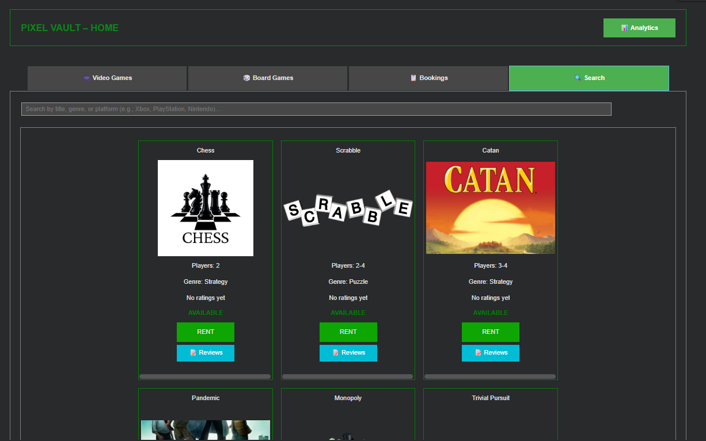
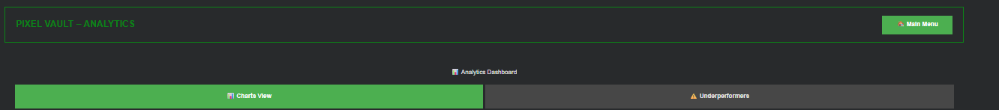
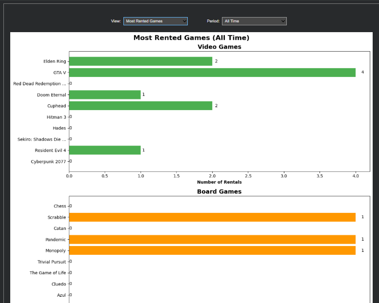
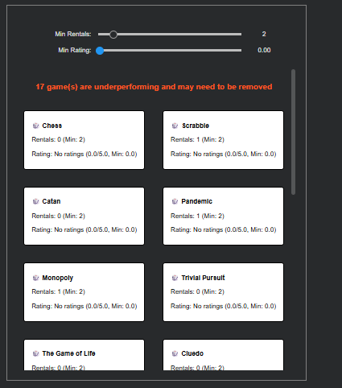

# Pixel Vault – Game Store Rental Management System

A game rental management system for a store that lends out video games and
board games, built with [`ipywidgets`](https://ipywidgets.readthedocs.io/)
for the UI. Originally built as a single Google Colab notebook
(`Board Game Store.ipynb`), this repo splits that notebook into standalone,
importable Python modules that work together as a normal codebase. 

## This was created as coursework for my first year programming module at loughborough university.


## Features

- **Video Games / Board Games tabs** — browse inventory as image cards with
  live availability, star ratings, and rent/return actions
- **Rentals** — rent a game to a customer ID, enforcing per-subscription
  rental limits (Basic vs Premium)
  
- **Returns** — returning a game requires a star rating and optional comment,
  which is saved as feedback
  
- **Reviews** — view all reviews and the average rating for any game
  
- **Bookings** — book in-store gaming sessions up to 30 days out, with a
  50-guest capacity limit per time slot and automatic pruning of expired
  bookings
  
  
- **Search** — live search across all games by title, genre, or platform
  
- **Analytics** — bar/pie charts of rental counts and star ratings (all-time,
  last 30 days, last 180 days), plus an "underperformers" view for pruning
  low-performing inventory
  
  
  

## Project layout for python files

```
├── main.py               # Entry point — launches the dashboard
├── dashboard.py           # Main menu / tab navigation
├── search.py               # Live search across all games
├── analytics.py            # Charts + underperforming-inventory view
├── bookings.py              # In-store session bookings
├── rental.py                 # Rent-a-game flow
├── game_return.py             # Return-a-game flow (+ feedback capture)
├── reviews.py                  # Reviews popup for a game
├── game_card.py                 # The image/info card widget for one game
├── helpers.py                    # Shared helpers: customer lookup, CSV I/O,
│                                  #   ratings, rental counts, image caching
│
├── subscriptionManager.pyc   # Provided compiled module (subscription rules)
├── feedbackManager.pyc       # Provided compiled module (feedback storage)
│
├── Board_Game_Info.txt       # Board game catalogue
├── Video_Game_Info.txt       # Video game catalogue
├── Rental.txt                # Rental records (read/written at runtime)
├── Game_Feedback.txt         # Feedback records (read/written at runtime)
├── Bookings.txt               # Booking records (read/written at runtime)
├── Subscription_Info.txt      # Customer subscriptions
│
├── notebooks/
│   ├── F529747_CW.ipynb      # Original coursework notebook (Colab)
│   └── menu.ipynb             # Original notebook verifying the .pyc modules
│
├── requirements.txt
└── README.md
```

The module dependency chain is linear, with no circular imports:

```
helpers ──┬─→ game_card ─┐
          ├─→ rental ────┤
          ├─→ game_return┤
          ├─→ reviews ───┼─→ search ─┐
          ├─→ bookings ──┤           ├─→ dashboard ─→ main
          └─→ analytics ─┘           │
                          └──────────┘
```

## Requirements

- **Python 3.12.x** — `subscriptionManager.pyc` and `feedbackManager.pyc`
  are compiled bytecode pinned to CPython 3.12's bytecode format. They will
  fail to import on other major/minor Python versions
  (`ImportError: bad magic number`). If you need a different Python version,
  you'd need the original `.py` sources for those two modules recompiled,
  which weren't part of this notebook's deliverables.
- A **Jupyter environment** — Jupyter Notebook, JupyterLab, or Google Colab.
  The UI is built entirely with `ipywidgets` + `IPython.display`, which need
  a live Jupyter frontend to render. Running `python main.py` from a plain
  terminal will execute without errors but won't display anything, since
  there's no notebook frontend to draw the widgets.

Install dependencies:

```bash
pip install -r requirements.txt
```

## Running - Jupyter Notebook

NOTE - `.pyc` files are in python 3.13.11

1. Download all files and run google colab
2. Open the `.ipny` file in colab to load the notebook
3. In your Colab notebook, click Runtime.
4. Click Change runtime type.
5. Look for Runtime Version.
6. Select: 2026.07
7. Import all the necessary text files using the first cell, by clicking `upload files`
8. Run the rest of the cells, where after the last one the UI should appear.

## Running - Python Files

1. Make sure `main.py` and the other `.py` files sit in the same folder as
   the `.txt` data files and the two `.pyc` modules (that's already the case
   in this repo — everything at the root belongs together).
2. Start Jupyter:
   ```bash
   jupyter notebook
   ```
3. In a new notebook cell, in that same folder, run:
   ```python
   import main
   ```
   The dashboard will render inline. Rerunning `import main` again in the
   same session won't re-execute it (Python caches imports) — use
   `import dashboard; dashboard.dashboard()` instead, or restart the kernel.

Alternatively, from a running Jupyter session you can use the `%run` magic:

```python
%run main.py
```

## Data files

All six `.txt` files are plain CSVs and are read/written directly by the app
(`Rental.txt`, `Game_Feedback.txt`, and `Bookings.txt` are appended to as you
rent, return, and book). Back them up before experimenting if you want to
preserve the sample data.

## Known limitations

Carried over from the original coursework's own security review — this was
built as a learning exercise, not a production system:

- Customer IDs are matched as plain text with no authentication or
  encryption.
- There's no concept of an admin role — anyone can rent, return, or
  manipulate any record.
- No validation guards against malformed or duplicate data entry beyond the
  checks described above (rental limits, booking capacity, date ranges).
- Errors (e.g. a malformed CSV row) aren't caught gracefully and will raise
  exceptions.
- There's no logging or audit trail of who did what.
